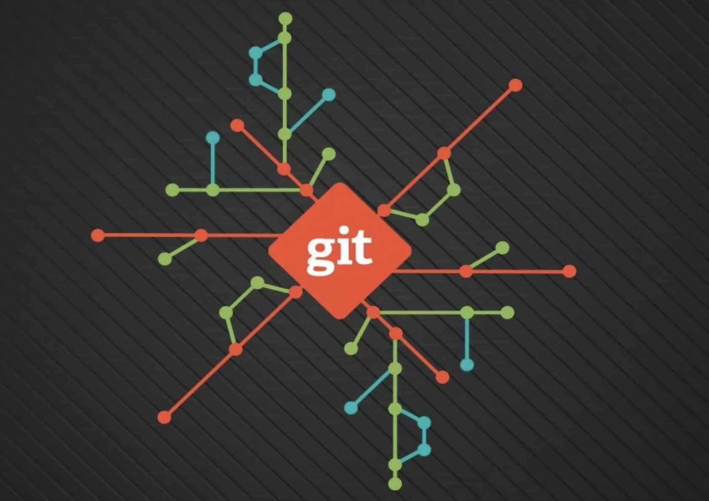

# Инструкция по работе с git

---
   ***Что такое git?***
   
Git — абсолютный лидер по популярности среди современных систем управления версиями. Это развитый проект с активной поддержкой и открытым исходным кодом. Система Git была изначально разработана в 2005 году Линусом Торвальдсом — создателем ядра операционной системы Linux. Git применяется для управления версиями в рамках колоссального количества проектов по разработке ПО, как коммерческих, так и с открытым исходным кодом. Система используется множеством профессиональных разработчиков программного обеспечения. Она превосходно работает под управлением различных операционных систем и может применяться со множеством интегрированных сред разработки (IDE).

Git — система управления версиями с распределенной архитектурой. В отличие от некогда популярных систем вроде CVS и Subversion (SVN), где полная история версий проекта доступна лишь в одном месте, в Git каждая рабочая копия кода сама по себе является репозиторием. Это позволяет всем разработчикам хранить историю изменений в полном объеме. Разработка в Git ориентирована на обеспечение высокой производительности, безопасности и гибкости распределенной системы.

1. Основные команды для работы с git
   1. **[git clone](./git%20clone.md)**
   2. **[git init](./git%20init.md)**
   3. **[git remote](./git%20remote.md)**
   4. **git status**
   5. **git add**
   6. **git commit**
   7. **git push**
   8. **Создание веток**
   9. **Слияние веток**
   10. **Удаление веток**
2. Решение конфликтов git
